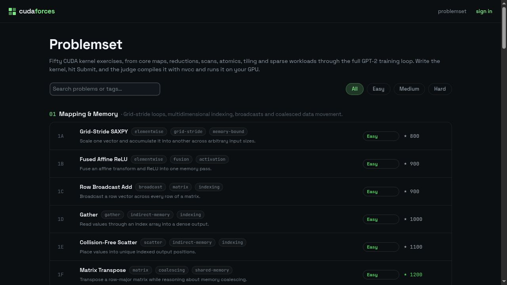
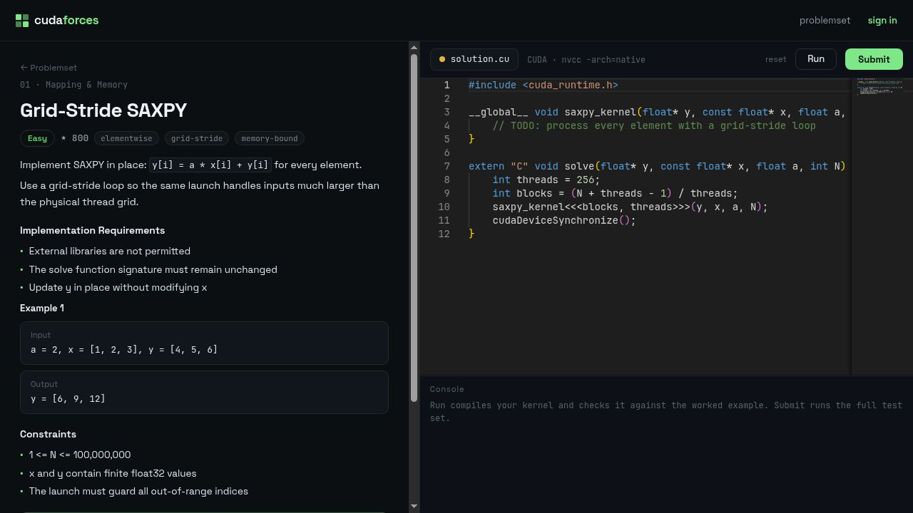

# cudaforces

A problemset for learning CUDA, inspired by Codeforces. Work through 50 kernel exercises in the browser, then compile and judge them locally with `nvcc` on your own GPU.

## Preview

### Problemset



### Problem workspace



## Requirements

- **CUDA toolkit** (`nvcc` on PATH, or set `NVCC_PATH`) and an NVIDIA GPU. The judge compiles and runs submissions locally.
- `uv` for Python dependencies

## Quick start

```bash
git clone https://github.com/pavelsimo/cudaforces
cd cudaforces
make setup       # install dependencies, migrate, and seed 50 problems
make gen-tests   # generate judge tests from the NumPy references
make dev
```

Visit [http://localhost:3000](http://localhost:3000). Continue as a guest, or sign in with any email. In development, the magic-link code is printed to the server console.

## How judging works

Each problem includes a `harness.cu` file that reads test input, calls your `solve()` function, and prints its output. A NumPy reference in `ref.py` generates the test files under `data/tests/<slug>/`.

When you submit:

1. `nvcc -O2 -arch=native solution.cu harness.cu` (compile error → **CE**)
2. Run each test with the input on stdin (crash → **RE**, timeout → **TLE**)
3. Compare outputs elementwise within per-problem float tolerances (mismatch → **WA**)
4. All tests pass → **Accepted**, and a `Solve` record marks the problem done

Judge a file headless without the UI:

```bash
uv run python -m cudaforces.judge residual-forward my_solution.cu
```

## Stack

| Layer | Technology |
|-------|-----------|
| Language | Python 3.13 |
| Frontend | Reflex (pure-Python UI, compiles to React) + Monaco editor |
| Judge | local `nvcc` + subprocess, NumPy reference implementations |
| API | FastAPI mounted into the Reflex backend (`api_transformer`) |
| Database | SQLite with WAL mode (SQLModel + Alembic) |
| Auth | Passwordless magic links |
| Tooling | uv · ruff · mypy · pytest · lefthook |
| Deploy | Kamal (single container: Caddy + Reflex backend) |

## Commands

| Command | Description |
|---------|-------------|
| `make dev` | Start development server (excludes `data/` from hot reload) |
| `make test` | Run tests with coverage (GPU judge tests auto-skip without nvcc) |
| `make ci` | Full CI suite (format check + lint + tests) |
| `make lint` | Run ruff + mypy |
| `make fmt` | Auto-format and fix lint offenses |
| `make gen-tests` | Generate judge test data (`data/tests/`) from NumPy references |
| `make db-makemigrations` | Generate a migration from model changes |
| `make db-migrate` | Apply pending migrations |
| `make db-reset` | Recreate the database and seed |
| `make sync-catalog` | Synchronize problem definitions into the database |
| `make deploy` | Deploy to production |

## Adding a problem

1. Add the statement/starter entry to `cudaforces/problems/content.json`
2. Create `cudaforces/problems/<slug_with_underscores>/` with `__init__.py`, `ref.py` (NumPy `tests()` + `solve()`), and `harness.cu`
3. `make seed && make gen-tests` (the registry upserts by slug)

## Documentation

- [Development guide](docs/development.md): local setup, workflow, architecture overview
- [Deployment guide](docs/deployment.md): Kamal setup and environment variables

## License

MIT © 2026 pavelsimo
